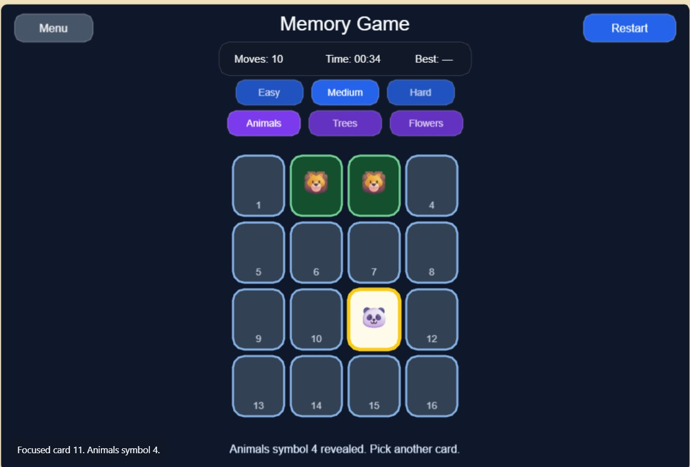
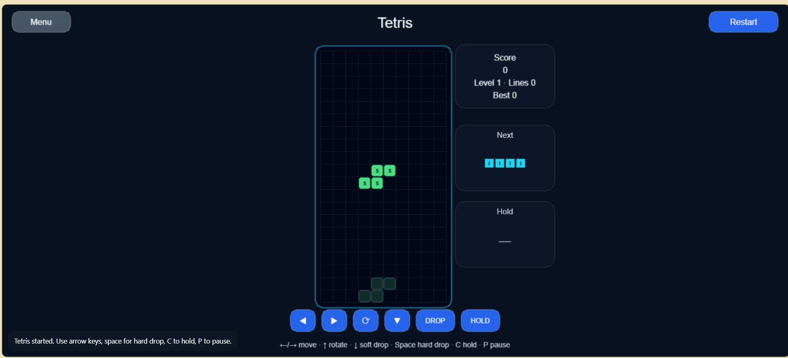
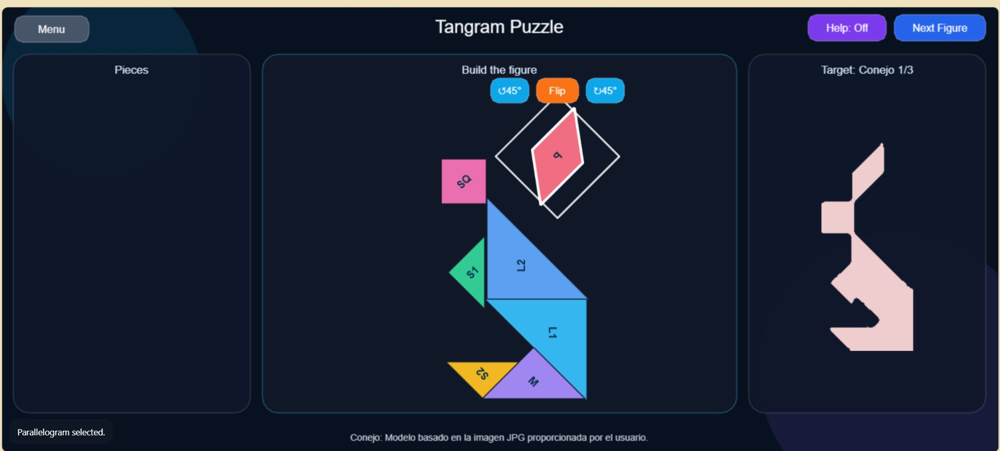

# Phaser Game Library

Reusable browser game library built with **Phaser + TypeScript + Vite**.


## Games included

- Memory Game: card matching with moves, timer, themes, difficulty and best score.

- Tetris: classic 10x20 board, next/hold/ghost piece, levels, score and keyboard/touch controls.

- Tangram: seven classic pieces, draggable/rotatable pieces, help guide, reset, next figure, collision correction and responsive three-section layout.


## Comentario

Comentario de ChatGPT cunado se le pidió usado para Tangram:


```text

En resumen: el prompt era completo en intención, pero demasiado abierto en assets, geometría, interacción exacta y criterios verificables. Para Tangram, la clave era haber definido desde el principio las plantillas reales y el comportamiento exacto de Help, Target, selección, rotación y flip.

## Shared navigation

The project starts on the landing page. Each game has a Menu button to return to the landing page.

## Structure

```text
/src
  /games
    /tetris
      TetrisScene.ts
    /memory
      Card.ts
      MemoryScene.ts
      memoryConfig.ts
    /tangram
      TangramScene.ts
  /shared
    AssetLoader.ts
    Button.ts
    GameSceneBase.ts
    ScorePanel.ts
    types.ts
```

## Requirements

- Node.js 20.19+ or 22.12+
- npm

## Install

```bash
npm install
```

## Run in development

```bash
npm run dev
```

Then open the local URL shown by Vite, usually:

```text
http://localhost:5173
```

## Build

```bash
npm run build
```

```

